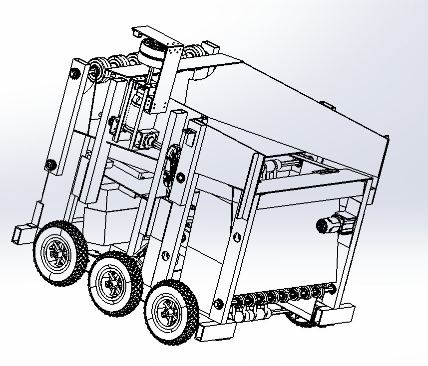

# 2020Robot 
This is the main robot code repo for [FRC Team 751's](https://www.team751.com/) 2020 "Infinite Recharge" Robot.

There are two main code parts in this repo
1. The core robot code, included in the [core751 submodule](https://github.com/team751/core751).
2. Robot/game-specific code/constants mainly located in the repo [here](https://github.com/team751/2020Robot/tree/master/src/main/java/frc/robot).

Licensed under the MIT License
